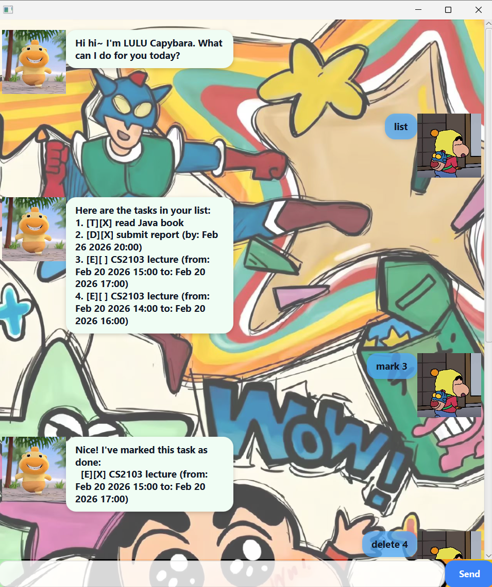

# 🧡 LULU Capybara – Cozy Task Manager  User Guide


LULU Capybara is a calm and friendly task manager designed to help you stay organised — slowly, steadily, and stress-free.

---

# 📌 Getting Started

Simply run the application and type your commands in the input box at the bottom.

All commands follow this format:

```
command [arguments]
```

---

#  Features

---

## 1. Add a Todo

Add a simple task without date or time.

```
todo read Java book
```

---

## 2️. Add a Deadline

Add a task that must be completed before a specific date and time.

```
deadline submit report /by 25 Feb 2026 20:00
```

📌 Format for date/time:

```
dd MMM yyyy HH:mm
```

Example:

```
26 Feb 2026 21:00
```

---

## 3️. Add an Event

Add a task with a start and end time.

```
event CS2103 lecture /from 20 Feb 2026 14:00 /to 20 Feb 2026 16:00
```

---

## 4️. List Tasks

Display all tasks in your list.

```
list
```

---

## 5️. Mark Task as Done

Mark a task as completed.

```
mark 3
```

---

## 6️. Unmark Task

Mark a task as not completed.

```
unmark 3
```

---

## 7️. Delete Task

Remove a task from the list.

```
delete 4
```

---

## 8️. Find Task

Search for tasks containing a keyword.

```
find lecture
```

---

## 9️. Update Task 

Update the description or date/time of an existing task without deleting it.

### 🔹 Update description only

```
update 2 /desc submit final report
```

---

### 🔹 Update a Deadline time

```
update 2 /by 26 Feb 2026 21:00
```

---

### 🔹 Update an Event time range

```
update 3 /from 20 Feb 2026 15:00 /to 20 Feb 2026 17:00
```

---

### 🔹 Update both description and time

```
update 3 /desc CS2103 tutorial /from 20 Feb 2026 14:00 /to 20 Feb 2026 16:00
```

---

### 📌 Important Notes

* `INDEX` refers to the task number shown in the `list` command.
* You can update:

    * **Todo** → description only
    * **Deadline** → description and `/by`
    * **Event** → description, `/from`, `/to`
* Date/time format must follow:

```
dd MMM yyyy HH:mm
```

---

## 10. Exit Application

Close LULU Capybara.

```
bye
```

---
## Command Summary
| Command      | Format                                                                      | Description                                 |
| ------------ | --------------------------------------------------------------------------- | ------------------------------------------- |
| **Todo**     | `todo DESCRIPTION`                                                          | Adds a task without date/time.              |
| **Deadline** | `deadline DESCRIPTION /by DATE_TIME`                                        | Adds a task with a due date and time.       |
| **Event**    | `event DESCRIPTION /from DATE_TIME /to DATE_TIME`                           | Adds a task with start and end time.        |
| **List**     | `list`                                                                      | Displays all tasks.                         |
| **Mark**     | `mark INDEX`                                                                | Marks a task as completed.                  |
| **Unmark**   | `unmark INDEX`                                                              | Marks a task as not completed.              |
| **Delete**   | `delete INDEX`                                                              | Deletes a task.                             |
| **Find**     | `find KEYWORD`                                                              | Searches tasks containing a keyword.        |
| **Update**   | `update INDEX /desc TEXT [/by DATE_TIME] [/from DATE_TIME] [/to DATE_TIME]` | Updates description or date/time of a task. |
| **Exit**     | `bye`                                                                       | Closes the application.                     |

---


